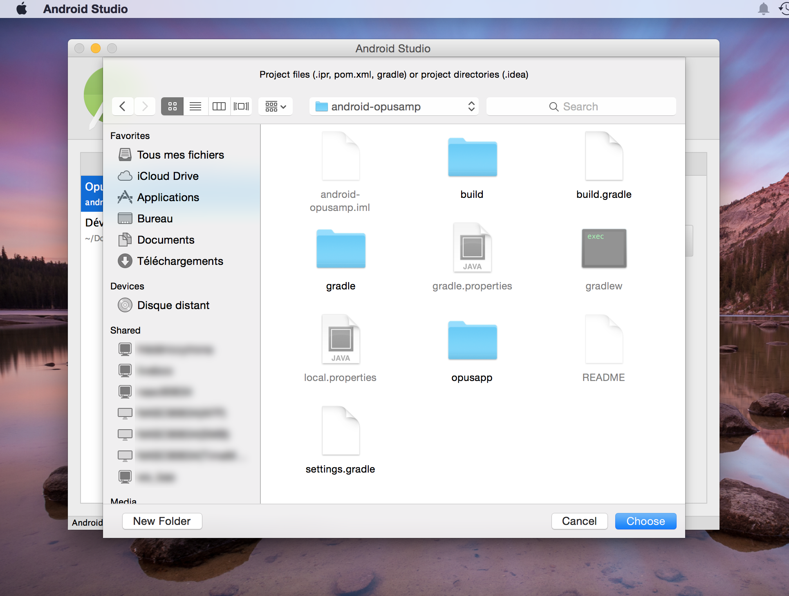
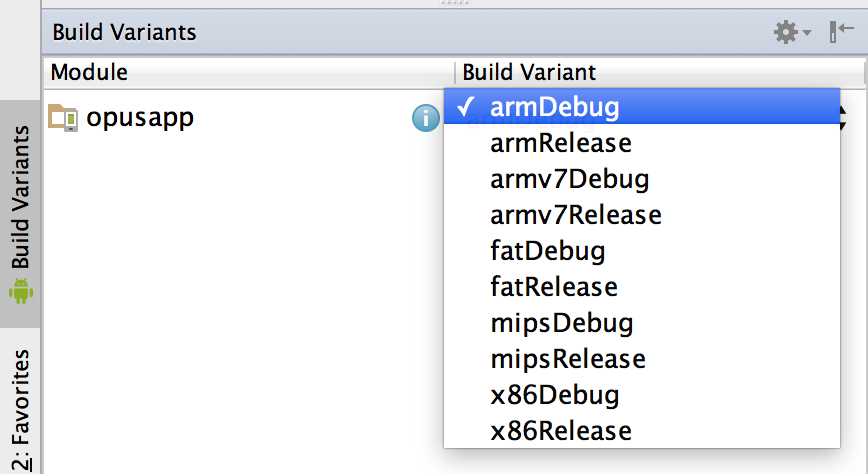
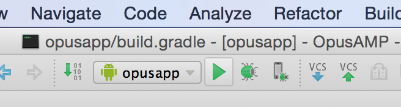

# OpusAMP Audio Player with FFMPeg based engine
## Powerful audio player for Android

* latest update: 01/21/2015
* by: Philippe Chepy
	

### Presentation and Features
		
OpusAMP is an efficient audio player for Android that manage all your local audio content. This app is perfectly suitable to play music thanks to algorithms that preserve content quality when playing audio files.

Note :

* The term "opus" in the name of this app doesn't refer to Opus audio codec, even if OpusAMP can play audio encoded with the free "opus" codec.

* Efficient audio rendering engine based on FFMpeg and SoxR resampler.
* Powerful media scanner (not using the media collection from Android OS)

Main features :

* Plays audio streams from most containers.
* Plays audio streams from video containers.
* Manage *multiple* libraries.
* Fast search in libraries.
* Playlists management.
* Repeat modes : repeat current track, repeat playlist, disabled.
* Plays track in order or randomly.
* Car mode with adapted user interface.
* Android design (material design).
* Customizable UI.
* Smoothly displays covers for albums and medias.
* UI for phone AND tablets.

Local libraries :

* Customizable file locations.
* Support excluded path in locations.
* Support for embedded art in media files.

Authorizations :

* READ_PHONE_STATE (Reading phone state is used to automatically pause player when calls are made.)
* WRITE_EXTERNAL_STORAGE (Writing to external storage is used to save cached data.)
* WAKE_LOCK (Wake lock is used to play medias when your device is sleeping.)

### Building Prerequisites

To build the project, you need Android Studio 1.0.

Android studio is available on the official android developer website page: [http://developer.android.com/sdk/index.html">http://developer.android.com/sdk/index.html](http://developer.android.com/sdk/index.html">http://developer.android.com/sdk/index.html)
	
If you want to rebuild jni libs, you need Android NDK r10c (other versions are maybe working but are not tested).

Originaly, jni code was built under Mac Os X 10.10 but Linux can be used too. Windows has not been tested at all for this task.

So, please, use a linux or osx (maybe virtual) machine to build the project jni libs.

Android NDK can be found on the official android developer website (page : [http://developer.android.com/tools/sdk/ndk/index.html](http://developer.android.com/tools/sdk/ndk/index.html))

Direct links for android NDK :

For Mac OS X 32 bit : [http://dl.google.com/android/ndk/android-ndk-r10c-darwin-x86.bin](http://dl.google.com/android/ndk/android-ndk-r10c-darwin-x86.bin)

For Mac OS X 64 bit : [http://dl.google.com/android/ndk/android-ndk-r10c-darwin-x86_64.bin](http://dl.google.com/android/ndk/android-ndk-r10c-darwin-x86_64.bin)

For Linux 32 bit : [http://dl.google.com/android/ndk/android-ndk-r10c-linux-x86.bin](http://dl.google.com/android/ndk/android-ndk-r10c-linux-x86.bin)

For Linux 64 bit : [http://dl.google.com/android/ndk/android-ndk-r10c-linux-x86_64.bin](http://dl.google.com/android/ndk/android-ndk-r10c-linux-x86_64.bin)

### How to Build

#### Native part
	
* Please remember you need a linux or mac os x platform. A windows platform may require more work to make compilation scripts working.*
	
##### Preparation
	
In the "opusapp/src/main/jni/3rdparty" directory, edit the "build.sh" file. Change the PATH variable at line 2 to contain the absolute path where you installed the NDK.
	
In the "opusapp/src/main/jni/3rdparty/src" directory, edit the "ffmpeg-build-android.sh" file to change the ANDROID_NDK variable at the top of the file to make this variable pointing to the same NDK path.

##### Now you can build the third party libraries with these steps :

* Open a terminal, then move to "opusapp/src/main/jni/3rdparty" directory
* Start the "build.sh" script.

##### After the building process for third party libraries is done, you can build medialib audio engine with these steps :

* Open a terminal, then move to "opusapp/src/main/jni/"
* Start&nbsp;the "build.sh" script.

When you are done with theses tasks, you have all required jni libraries to make OpusAMP working.

#### Java part

For the Java code, if you want to create "releases" of your project, you just have to edit the gradle build script : "opusapp/build.gradle"

You must change informations for the signing configuration to match your keystore :

    signingConfigs {
         release {
              storeFile file("/path/to/your/keystore")
              storePassword "keystore password"
              keyAlias "key alias"
              keyPassword "key password"
         }
    }

#### Building process

Open Android Studio, and click on "Open an existing Android Studio project" :

Select the project location :

Choose the right arch for your device.

For testing purpose, you should select a "debug" build. In most case your platform will be "arm", if you are unsure, you can select a "fat" build type.

Execute to a real or virtual device.

### Creating release APK

Move to project path in a terminal and simply start "./gradlew assembleRelease". Running this command imply you have jni libs available in project (if you don't have rebuild jni libs, that's OK). You also must have edited your signing config in gradle build script (see above).

APK are in "opusapp/build/outputs/apk".

There is an APK for each 32 bit platforms Android support (arch is "arm", "armv7", "mips" or "x86"), and one universal APK (arch is "fat").

### Third party libraries

* OpusAMP is an efficient audio player using its own decoding engine based on FFMpeg.
* Audio quality is preserved when resampling by using the SoxR resampling library.
* Metadata are analyzed with the help of TagLib metadata library from KDE Project.

Theses third party libraries are Open Source and are available from their respective websites :

* FFMpeg (licensed under LGPL) : [http://www.ffmpeg.org/](http://www.ffmpeg.org/)
* TagLib (licensed under APL) : [http://taglib.github.io/](http://taglib.github.io/)
* SoxR (licensed under LGPL) : [http://sourceforge.net/projects/soxr/](http://sourceforge.net/projects/soxr/)
